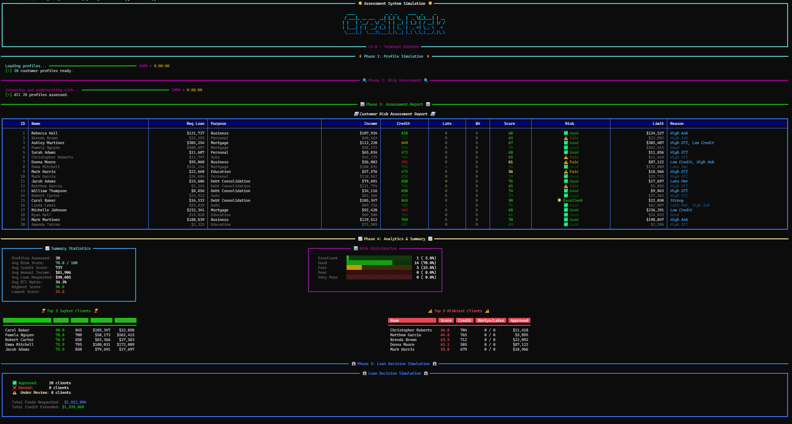

# Credit Risk Assessment System Simulation

A terminal-based app that mimics credit risk assesment for a pool of customers using a weighted scorecard algorithm. It features animated progress bars, pretty tables, and aggregated summary analytics.

<p align="center">
  
</p>

## 🌟 Features

- **Realistic Scoring Model**: Evaluates applicants utilizing factors such as credit score, payment history, DTI limit, credit utilization, recent bankruptcies, and missed history.
- **Dynamic Application Parsing**: Reads actual applicant data from a standard `.CSV` file.
- **Output Report Generation**: Saves fully assessed applicants—including their calculated limits and rates—back to a `.CSV` file.
- **Auto-Generated Simulation**: Easily test the algorithmic limits by simulating 50+ random client profiles with statistically correlated fields.
- **Beautiful Terminal TUI**: Animated load progress, color gradients, informative emojis, custom bar charts, and dynamically aligned comparison columns leveraging `rich`.

## 📁 Repository Structure

We employ a modular architecture:

- `models.py`: Contains the `Profile` dataclass definition handling entity structure.
- `assessment.py`: The robust scoring algorithm returning risk and limits calculations.
- `data_io.py`: Ingests and exports `.CSV` files mapped explicitly to the `Profile` model.
- `generator.py`: An engine returning populated `Profile` objects full of realistic fake data.
- `ui.py`: Manages all `rich` terminal printing, rendering the tables, columns, and dashboards.
- `main.py`: The application entry point managing configuration logic and executing the simulation/pipeline.

## 🚀 Installation

Ensure you have Python 3.8+ installed. 

1. Clone the repository:
   ```bash
   git clone https://github.com/yourusername/credit-risk-simulation.git
   cd credit-risk-simulation
   ```

2. Install the required dependencies:
   ```bash
   pip install -r requirements.txt
   ```

## 💻 Usage

Run the primary application script via `python main.py` using any of the arguments below.

```bash
usage: main.py [-h] [--simulate NUM] [--input FILE] [--output FILE]
```

### Options

| Flag | Description |
| ---- | ----------- |
| `--simulate [N]` | Run a generated simulation with `[N]` random profiles. If omitted alongside `--input`, defaults to `50`. |
| `--input [FILE.csv]` | Process real applicant data loaded from a provided CSV file path instead of generating fake data. |
| `--output [FILE.csv]` | Export the fully assessed profiles pipeline results to a CSV file. |
| `-h, --help` | Display the helper text. |

### Examples

**Run the default simulation (50 profiles):**
```bash
python main.py
```

**Run a larger simulation (500 profiles):**
```bash
python main.py --simulate 500
```

**Process a real dataset and dump the results:**
```bash
python main.py --input raw_clients.csv --output assessed_results.csv
```

## 📊 CSV Input Format

If using `--input`, your target CSV should have the following headers (order doesn't matter):

`id, name, age, occupation, annual_income, credit_score, existing_debt, employment_years, num_credit_accounts, payment_history, credit_utilization, loan_amount_requested, loan_purpose, recent_bankruptcies, missed_payments_history`

## 🧠 Risk Assessment Algorithm

The assessment logic computes a composite score (0-100) weighted across seven categories:

- **30%**: Credit Score
- **20%**: Payment History (adjusted heavily depending on previous missed payment events)
- **15%**: Debt-to-Income (DTI)
- **10%**: Emploment Stability
- **10%**: Credit Utilization Ratio
- **10%**: Loan Amount to Income Ratio
- **5%**: Requested Loan Purpose Risk

Modifiers:
- Applicants possessing any `recent_bankruptcies` automatically face a maximum score cap at "Very Poor".
- Extremely high DTI applies secondary multiplicative constraints.
